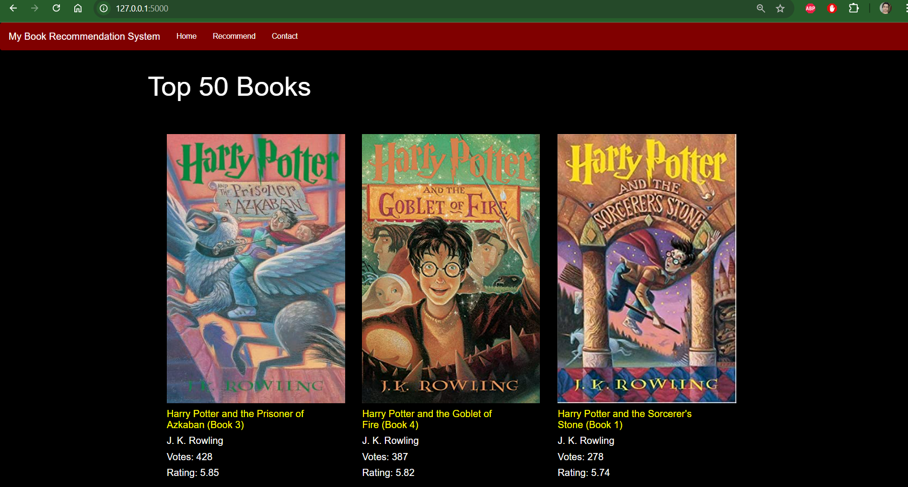
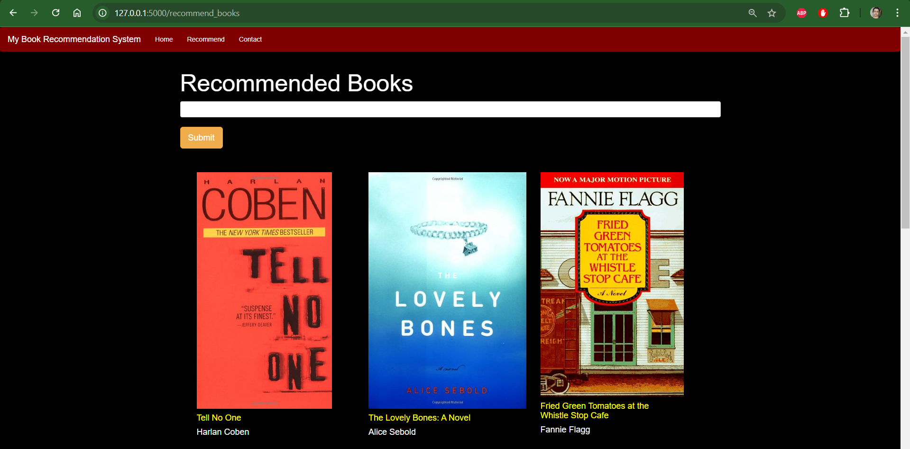

Overview

This project uses Flask and HTML to create a book recommendation system. It combines popularity-based recommendations with item-item collaborative filtering to suggest books to users.

Features

Input Form: Users can enter book names via a web form.

Database Access: The system retrieves book info from a digital database file.

Recommendations:

Top 50 Books: Displays popular books.
Search: Helps users find specific books.

Setup

Clone this repository.
Install dependencies (Flask, etc.).
Run the Flask app locally.

Here is the link of the database refinement from csv file.

https://colab.research.google.com/drive/13zHEU9LwgM7XDxS6dYN1U7AFbLYyKscM?usp=sharing

